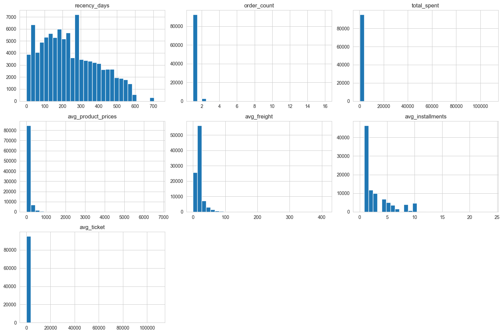
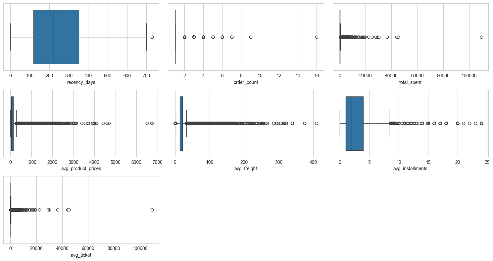
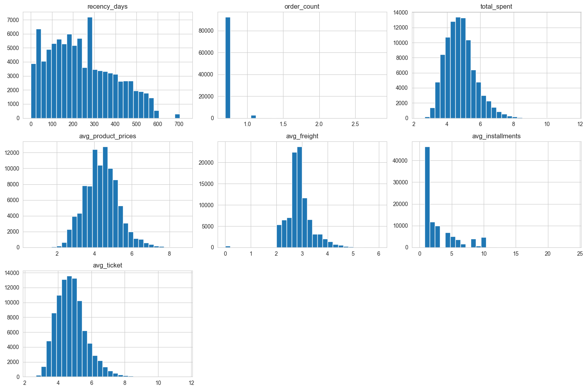
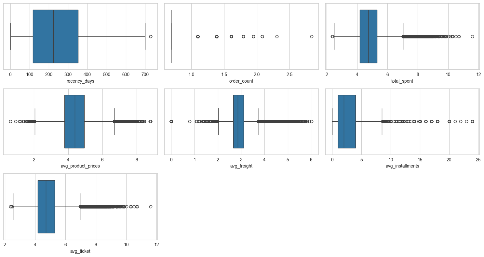
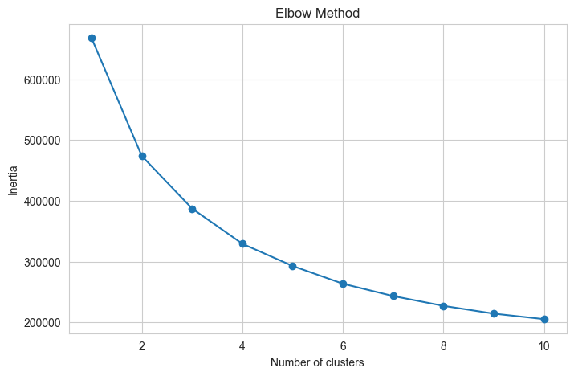
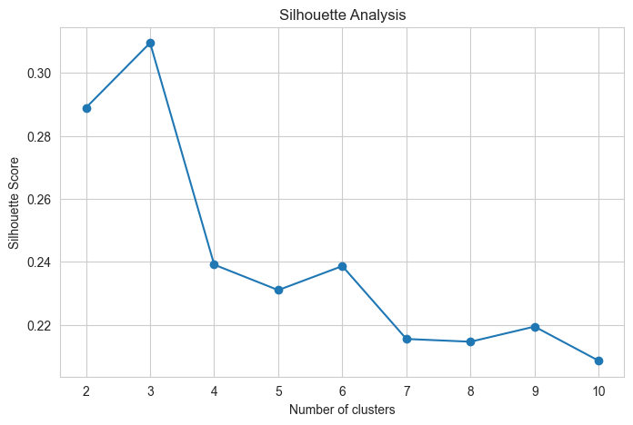
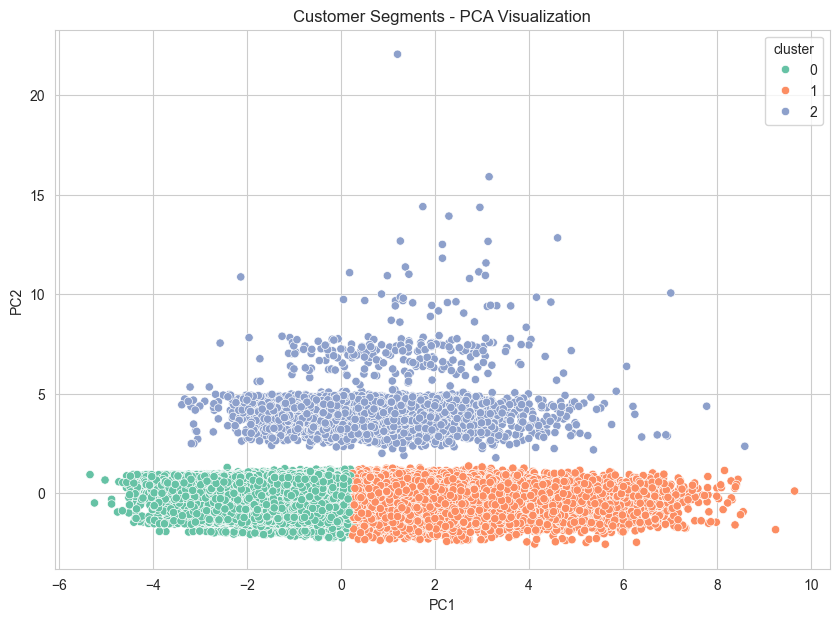

# E-commerce Customer Segmentation using Machine Learning

Customer segmentation project using Machine Learning techniques to identify distinct purchasing behaviors and support personalized marketing strategies in e-commerce environments.

---

# Project Overview

Customer segmentation is one of the most valuable applications of Data Science in e-commerce. By grouping customers according to their purchasing behavior, companies can develop targeted marketing campaigns, improve customer retention, optimize resource allocation, and increase customer lifetime value.

This project applies K-Means Clustering to the Brazilian E-Commerce Public Dataset by Olist to identify meaningful customer groups based on transactional behavior, spending patterns, product preferences, freight costs, and payment characteristics.

The resulting segmentation framework provides actionable business insights that can support customer relationship management and personalized marketing strategies.

---

# Business Problem

E-commerce businesses often treat all customers equally, despite significant differences in purchasing behavior.

Some customers purchase only once, others consistently generate high revenue, and a small group becomes highly engaged repeat buyers.

Without proper segmentation, marketing efforts become inefficient and customer retention opportunities may be missed.

The goal of this project is to identify distinct customer groups that can support:

- Personalized Marketing Campaigns
- Customer Retention Programs
- Loyalty Initiatives
- Revenue Optimization
- Customer Lifetime Value Growth
- Product Recommendation Systems

---

# Dataset

## Olist Brazilian E-Commerce Dataset

The dataset contains real-world Brazilian e-commerce transactions and includes information about:

- Orders
- Customers
- Products
- Payments
- Reviews
- Sellers
- Freight Costs
- Geolocation

Dataset Source:

https://www.kaggle.com/datasets/olistbr/brazilian-ecommerce

---

# Dataset Size

After integrating multiple transactional tables and performing preprocessing:

- 95,419 unique customers
- Multiple transactional datasets merged
- Customer-level behavioral dataset created for clustering

---

# Technologies Used

- Python
- Pandas
- NumPy
- Matplotlib
- Seaborn
- Scikit-Learn
- K-Means Clustering
- PCA (Principal Component Analysis)
- StandardScaler
- Jupyter Notebook

---

# Project Workflow

1. Data Loading
2. Dataset Integration
3. Feature Engineering
4. Exploratory Data Analysis
5. Outlier Analysis
6. Log Transformation
7. Data Scaling
8. K-Means Clustering
9. Elbow Method Analysis
10. Silhouette Score Analysis
11. Cluster Profiling
12. PCA Visualization
13. Business Insights
14. Project Conclusion

---

# Feature Engineering

To represent customer behavior, the following features were created:

| Feature | Description |
|----------|----------|
| Recency | Days since the customer's last purchase |
| Order Count | Number of completed orders |
| Total Spend | Total amount spent |
| Average Product Price | Average product value |
| Average Freight | Average freight cost |
| Average Installments | Average payment installments |
| Average Ticket | Average value per purchase |

These features capture customer engagement, spending behavior, purchase frequency, payment preferences, and overall purchasing patterns.

---

# Exploratory Data Analysis

Understanding the data distribution is essential before applying clustering algorithms.

The initial analysis revealed highly skewed distributions and the presence of significant outliers across spending-related variables.

---

## Feature Distributions Before Transformation



The original customer features exhibited strong positive skewness.

Most customers generated relatively low spending levels and placed only one order, while a small number of customers exhibited exceptionally high purchase values.

This long-tail behavior is common in e-commerce environments and highlights the presence of highly valuable customers that differ substantially from the majority of the customer base.

Variables such as:

- Total Spend
- Average Product Price
- Average Ticket

showed particularly strong skewness.

These characteristics can negatively impact distance-based clustering algorithms such as K-Means.

---

## Outlier Analysis Before Transformation



The boxplots reveal a large number of extreme observations across spending-related variables.

Rather than removing these observations, they were preserved because they likely represent strategically important customer groups, particularly premium and loyal customers.

Instead of eliminating potentially valuable information, a logarithmic transformation was applied to reduce their influence while preserving behavioral patterns.

# Log Transformation

To reduce skewness and improve cluster quality, a Log1p transformation was applied.

This approach compresses extreme values while maintaining the relative differences between customers.

Logarithmic transformations are particularly useful in e-commerce datasets, where a small number of customers often generate disproportionately high spending compared to the majority of the customer base.

---

## Feature Distributions After Transformation



The transformation significantly improved feature distributions.

Previously skewed variables became substantially more symmetrical, reducing the dominance of extreme observations and making customer behavior patterns more comparable.

This preprocessing step improves the effectiveness of K-Means by making distances between observations more meaningful.

The resulting distributions provide a more balanced representation of customer purchasing behavior and reduce the risk of clusters being dominated by a small number of high-spending customers.

---

## Outlier Analysis After Transformation



Following the logarithmic transformation, the spread of the variables became considerably more balanced.

Although some outliers remain, their influence was substantially reduced.

This allows the clustering algorithm to focus on broader behavioral patterns rather than being overly influenced by extreme spending observations.

As a result, customer groups can be identified based on meaningful differences in purchasing behavior rather than isolated exceptional cases.

---

# Determining the Optimal Number of Clusters

Selecting the appropriate number of clusters is one of the most important steps in customer segmentation.

To ensure a robust clustering solution, two complementary evaluation methods were applied:

- Elbow Method
- Silhouette Analysis

Both techniques consistently indicated that three clusters provided the best balance between segmentation quality and model simplicity.

---

## Elbow Method



The Elbow Method evaluates how the Within-Cluster Sum of Squares (WCSS) decreases as the number of clusters increases.

A sharp reduction in inertia can be observed between one and three clusters.

After k=3, the improvement becomes progressively smaller, indicating diminishing returns from adding additional clusters.

This behavior suggests that three clusters provide a meaningful segmentation structure while avoiding unnecessary complexity.

The Elbow Method therefore identifies k=3 as a strong candidate for the final clustering solution.

---

## Silhouette Analysis



The Silhouette Score measures how similar customers are to their own cluster compared to other clusters.

Higher values indicate better cluster separation and stronger cluster cohesion.

The analysis identified **k = 3** as the optimal number of clusters, achieving the highest silhouette score of approximately **0.31**.

This result confirms that the three-cluster solution provides the most meaningful customer segmentation structure within the dataset.

By combining the Elbow Method and Silhouette Analysis, the project ensures that the final clustering configuration is supported by multiple evaluation criteria rather than arbitrary selection.

---

# Customer Segmentation Results

The K-Means algorithm identified three distinct customer segments based on purchasing behavior.

These segments differ significantly in terms of spending levels, purchase frequency, and overall customer value.

| Cluster | Customers | Percentage |
|----------|----------:|----------:|
| Economic Customers | 54,385 | 57.1% |
| Premium Customers | 38,121 | 40.0% |
| Loyal Customers | 2,913 | 3.1% |

Although Loyal Customers represent only a small fraction of the customer base, they generate the highest spending levels and exhibit the highest purchase frequency.

This finding highlights the importance of understanding customer heterogeneity and developing targeted retention strategies.

---

# Customer Profiles

The cluster profiling analysis provides a detailed understanding of the purchasing behavior associated with each customer segment.

---

## Cluster 0 — Economic Customers

| Metric | Value |
|----------|----------:|
| Customers | 54,385 |
| Average Spend | R$75.97 |
| Average Orders | 1.00 |
| Average Ticket | R$75.97 |

This segment represents the largest customer group, accounting for more than half of the customer base.

Economic Customers generally make a single purchase and spend relatively little compared to the other segments.

These customers appear to be highly price-sensitive and may respond positively to:

- Discounts
- Free shipping campaigns
- Entry-level promotions
- Seasonal offers

Although individually less valuable, their large volume makes them strategically important for customer acquisition initiatives.

---

## Cluster 1 — Premium Customers

| Metric | Value |
|----------|----------:|
| Customers | 38,121 |
| Average Spend | R$389.67 |
| Average Orders | 1.00 |
| Average Ticket | R$389.67 |

Premium Customers spend substantially more per transaction than Economic Customers.

Although they typically place only one order, the value of each purchase is considerably higher.

This segment contributes significantly to overall revenue generation and may respond well to:

- Premium product recommendations
- Upselling strategies
- Exclusive collections
- Personalized offers

Their purchasing behavior suggests a strong preference for higher-value products.

---

## Cluster 2 — Loyal Customers

| Metric | Value |
|----------|----------:|
| Customers | 2,913 |
| Average Spend | R$453.86 |
| Average Orders | 2.11 |
| Average Ticket | R$212.47 |

Loyal Customers represent only 3.1% of the customer base.

However, they exhibit the highest spending levels and the highest purchase frequency among all segments.

This group generates exceptional business value because customers return repeatedly and maintain high overall spending.

These customers are ideal candidates for:

- Loyalty Programs
- VIP Memberships
- Retention Campaigns
- Personalized Marketing
- Exclusive Benefits

Protecting and nurturing this segment should be a priority for long-term revenue growth.

---

# PCA Visualization



Principal Component Analysis (PCA) was applied to reduce the dimensionality of the dataset and enable visual inspection of the customer segments.

The visualization demonstrates a meaningful separation between the three clusters identified by the K-Means algorithm.

Economic Customers and Premium Customers are primarily separated along the first principal component, while Loyal Customers form a distinct region in the upper portion of the visualization.

This separation suggests that the engineered behavioral features successfully captured meaningful differences in customer purchasing behavior and that the clustering algorithm identified real customer segments rather than arbitrary partitions.

The PCA projection provides additional validation for the segmentation strategy and reinforces the effectiveness of the clustering approach.

---

# Business Insights

The segmentation analysis revealed several valuable business insights.

### Economic Customers

- Represent 57.1% of the customer base.
- Generate relatively low revenue per customer.
- Typically purchase only once.
- Likely respond well to discounts and promotional campaigns.
- Important for customer acquisition and market reach.

### Premium Customers

- Represent 40.0% of the customer base.
- Generate significantly higher revenue per transaction.
- Purchase less frequently but spend substantially more per order.
- Ideal candidates for upselling and premium product recommendations.

### Loyal Customers

- Represent only 3.1% of customers.
- Generate the highest overall spending levels.
- Exhibit the highest purchase frequency.
- Provide the greatest long-term business value.

### Strategic Findings

- A small percentage of customers contributes disproportionately to revenue generation.
- Retention efforts focused on Loyal Customers could significantly increase Customer Lifetime Value (CLV).
- Personalized marketing campaigns can improve conversion rates and customer engagement.
- Different customer segments require different communication, pricing, and retention strategies.

---

# Marketing Recommendations

Based on the identified customer segments, the following business actions could be implemented:

### Economic Customers

- Discount campaigns
- Free shipping offers
- Entry-level product recommendations
- Seasonal promotions

### Premium Customers

- Premium product recommendations
- Upselling strategies
- Exclusive collections
- Personalized offers

### Loyal Customers

- Loyalty programs
- VIP memberships
- Exclusive benefits
- Early access campaigns
- Retention-focused initiatives

These strategies can help maximize revenue while improving customer satisfaction and retention.

---

# Project Limitations

Although the segmentation produced meaningful results, some limitations should be considered.

### Data Limitations

- Customer demographic information was not included.
- Customer reviews and satisfaction metrics were not incorporated.
- Geographic information was not used in the clustering process.

### Modeling Limitations

- Segmentation was based exclusively on purchasing behavior.
- K-Means assumes spherical clusters and similar variance across groups.
- Customer behavior may evolve over time.
- The analysis provides a static snapshot rather than a dynamic behavioral model.

### Business Limitations

- Customer Lifetime Value (CLV) was not explicitly calculated.
- External factors such as seasonality and marketing campaigns were not incorporated.

Future versions of the project could address these limitations through additional feature engineering and alternative clustering approaches.

---

# Future Improvements

Several enhancements could further improve the quality and business value of the segmentation model.

### Modeling Improvements

- Test DBSCAN clustering.
- Test Hierarchical Clustering.
- Evaluate Gaussian Mixture Models (GMM).
- Compare alternative segmentation techniques.

### Feature Engineering Improvements

- Incorporate Customer Lifetime Value (CLV).
- Add customer satisfaction metrics.
- Include review scores.
- Add recency trends over time.

### Business Improvements

- Create personalized recommendation systems for each segment.
- Develop automated marketing strategies.
- Build customer retention prediction models.
- Integrate segmentation into CRM workflows.

### Deployment Improvements

- Develop an interactive Power BI dashboard.
- Build a Streamlit application.
- Deploy the segmentation pipeline as an API.
- Automate customer classification for new users.

---

# Project Conclusion

This project applied Machine Learning techniques to identify meaningful customer segments within a large e-commerce dataset.

Using K-Means Clustering, three distinct customer groups were identified:

- Economic Customers
- Premium Customers
- Loyal Customers

The analysis demonstrated that customer purchasing behavior varies substantially across the customer base and that a relatively small group of Loyal Customers generates disproportionately high business value.

The combination of feature engineering, outlier treatment, logarithmic transformation, clustering evaluation techniques, and PCA visualization enabled the creation of a robust customer segmentation framework.

The resulting segmentation can support:

- Personalized Marketing
- Customer Retention
- Loyalty Programs
- Revenue Optimization
- Customer Relationship Management

This project demonstrates how Machine Learning can transform transactional data into actionable business insights and support data-driven decision-making.

---

# Key Project Results

| Metric | Result |
|----------|----------|
| Customers Analyzed | 95,419 |
| Features Engineered | 7 |
| Optimal Number of Clusters | 3 |
| Silhouette Score | ~0.31 |
| Largest Segment | Economic Customers (57.1%) |
| Highest Value Segment | Loyal Customers |
| Clustering Algorithm | K-Means |
| Visualization Technique | PCA |

---

# Project Structure

```bash
Customer-Segmentation/
│
├── data/
│
├── images/
│   ├── distributions_before.png
│   ├── boxplots_before.png
│   ├── distributions_after.png
│   ├── boxplots_after.png
│   ├── elbow_method.png
│   ├── silhouette_analysis.png
│   └── customer_segments_pca.png
│
├── notebooks/
│   └── Ecommerce_Customer_Segmentation_Project.ipynb
│
├── README.md
├── requirements.txt
└── .gitignore
```

---

# Author

**Talita Niqian Lin Wu**  

LinkedIn:
https://www.linkedin.com/in/talita-niqian-lin-wu/

GitHub:
https://github.com/TalitaNLinWu